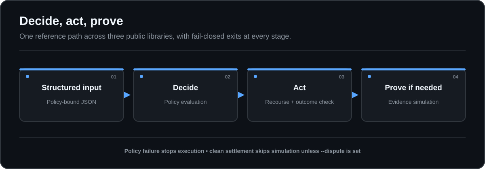

# Agent Action Stack

**One reference path across three public libraries: decide, act, prove.**

Agent Action Stack is a thin orchestrator. It does not re-implement the libraries. It runs them in a fixed order so a visitor can see how they compose.



On policy failure the stack stops. On a clean `settled` outcome, MandateBound is skipped unless you pass `--dispute`.

> Experimental reference demo. Not legal advice, not a hosted service, not a safety certification.

## Libraries used

| Stage | Public repo | Role in this demo |
| --- | --- | --- |
| Decide | [constitutional-agent-testbench](https://github.com/EauDoon/constitutional-agent-testbench) | Evaluate refund-authorization JSON against a declared policy |
| Act | [consequence-rail](https://github.com/EauDoon/consequence-rail) | Reserve recourse, execute a synthetic refund, settle or compensate |
| Prove | [mandatebound](https://github.com/EauDoon/mandatebound) | Run a dispute-oriented evidence simulation when the rail outcome needs review |

## Requirements

- Node.js 20+
- Python 3.11+ (stdlib only; no pip install required for the testbench)
- git
- network access once, for `npm run bootstrap` (clones the three public repos into `deps/`)

Private repositories are never cloned or modified.

## Quick start

```bash
npm run bootstrap
npm run demo
```

Expected human output (pass path, no fault):

```text
stack: agent-action-stack
response: pass
decide: passed
decide_passed: true
act: passed
act_outcome: settled
act_state: CLOSED
act_fault: none
prove: skipped
prove_scenario: none
prove_triggered_by: none
flow: decide -> act
bundle: .out/runs/<run-id>
```

Fail closed at decide:

```bash
npm run demo:fail
```

Force the dispute path via a compensated rail outcome:

```bash
npm run demo:dispute
```

Expected flow line:

```text
flow: decide -> act -> prove
```

JSON report:

```bash
node ./bin/aas.mjs demo --fault duplicate --json
```

## Reproducibility and run bundles

`stack-lock.json` records the reviewed public repository URLs, exact commits, and
expected entrypoints. Bootstrap uses detached checkouts, rejects substituted or
dirty pre-existing directories, runs `npm ci --ignore-scripts` for MandateBound,
then runs its explicit build command.

Each decide, act, and prove child is bounded by `AAS_CHILD_TIMEOUT_MS`
(default 30000). A hung child fails the stage instead of blocking the run.
Empty `AAS_CHILD_TIMEOUT_MS` and `AAS_GUI_PORT` values keep those defaults;
invalid integers are rejected.

Each invocation writes one atomic bundle under `.out/runs/<run-id>/`:

- `manifest.json`: stage status and component provenance
- `report.json`: user-facing run report
- `stages/*.json`: output from stages that ran

`.out/latest.json` is an atomic pointer to the most recent complete bundle. A
failed or skipped stage cannot leave an older stage artifact looking current.

## Guided local GUI

Run `npm run gui` and open the printed loopback URL. The GUI calls the same
orchestrator, displays stage and provenance state, and downloads a JSON export
of the selected run bundle. `npm run gui:smoke` checks the server without
starting a long-running process. The server binds only to `127.0.0.1` on port
8787 by default (`AAS_GUI_PORT` selects another loopback port), requires the
exact loopback Host and same-origin boundary, and uses POST for a run.

## Tests

```bash
npm test
npm run check
```

## Fixtures

- `fixtures/policy.json`: refund gate: accept, low/moderate risk, recourse required, not blocked
- `fixtures/response.pass.json`: passes the gate
- `fixtures/response.fail.json`: fails the gate; act and prove are skipped

## Design bounds

- Orchestration only. Behavior lives in the three libraries.
- Synthetic connectors and scenarios only.
- MandateBound’s prove step uses `simulate --scenario operator` as the dispute-oriented demo path. Full AP2 pack assemble/verify remains in MandateBound’s own CLI and docs.
- This repo does not read or write any private GitHub repositories.

## License

Apache-2.0
